# DHIS2 app installation

DHIS2 is a popular open source and open standards-based HMIS in global health. The Facility Reconciliation Tool can be installed as a DHIS2 app and configured as required to restrict users to the organization units they need to access. 

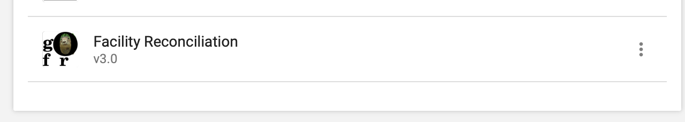

## Features

The Facility Reconciliation DHIS2 App has the ability to:
* Authenticate only using DHIS2 users and roles.
* Add DHIS2 users to data sources and data pairs.
* Restrict DHIS2 users to specific data pairs or one pair.
* Restrict users to specific organizational units in DHIS2 and have this reflected in access in the Facility Reconciliation Tool.

## Install DHIS2 app on the same server running DHIS2

For the Facility Reconciliation Tool to be used as a DHIS2 app, the standalone tool itself must be installed. It is expected that the tool is installed on the same server as DHIS2. 

Clone the GitHub repository.
```sh
git clone git@github.com:openhie/facility-recon.git
cd facility-recon
```

Log in as an admin in DHIS2 with permission to install apps. Open the app called `App Management`.

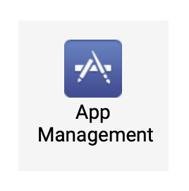

Choose to install an app using the button on the far right.

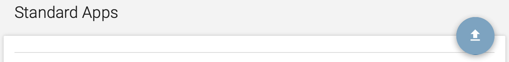

A file chooser will open. Select the already packaged `.zip` file in the GitHub repository folder `dhis2App`.

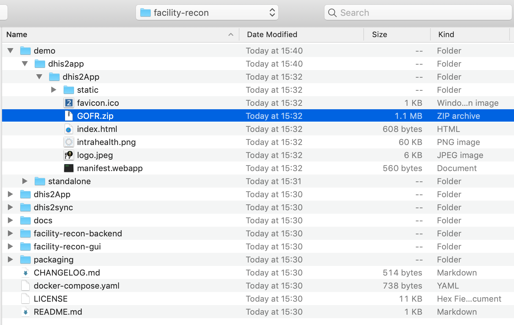

**To install the app on the DHIS2 demo playground you need a different package, see modifications below.**

**To point the app at another server for the backend you need a different package, see modifications below.**

Now the DHIS2 app is installed. Confirm:


**After installing the app but before setting up DHIS authentication, set the user role in DHIS2 to have permissions.**

## Add app permission to User Role

External authentication works by associating a DHIS2 user role. The Facility Reconciliation Tool must know the user role. The user role that is selected to manage the tool must have permissions added otherwise if it is not then the user will be locked out.

Click on the Users app in the app menu dropdown.

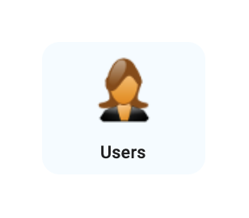

In the users app menu, select User Roles.

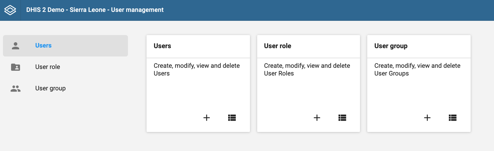

Select the name of the user role you will use to manage the Facility Reconciliation App. This will take you to a detailed view of the authorities granted to that user role.

Under Apps check the box next to Facility Reconciliation app.

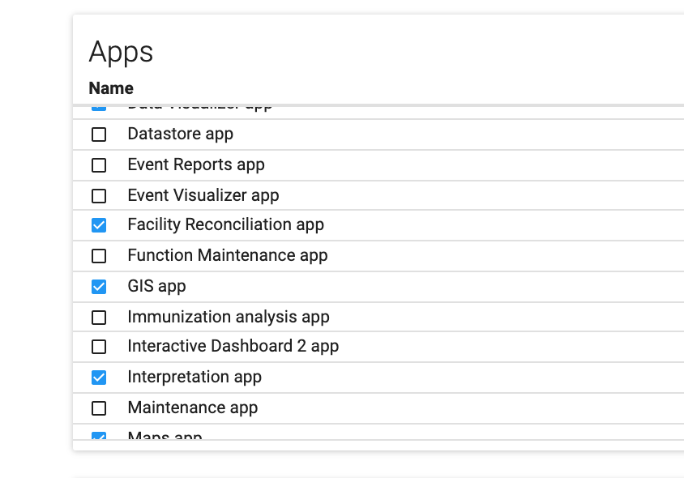

Click Save at the bottom on the page to submit the change.

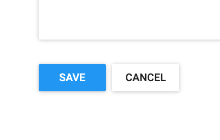


## Setup DHIS2 authentication

Back on the apps dropdown, click on the now-installed Facility Reconciliation app icon to finish configuration and setup authentication.

Under Configure Settings turn on external authentication. Select DHIS2 as the authentication point.

Select the superuser role in DHIS2 that will be used to administer facility reconciliation. 

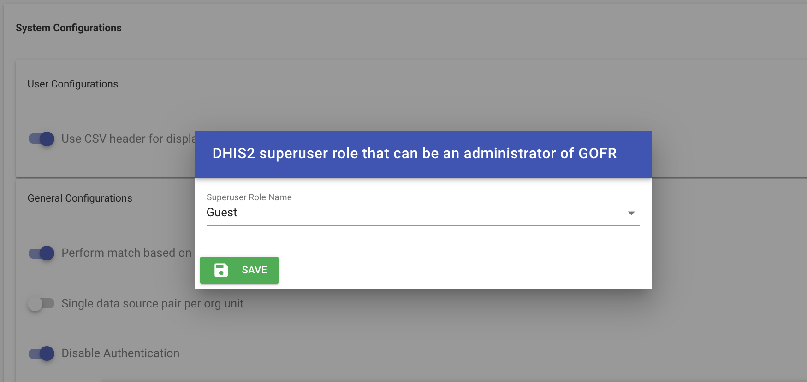

Then, enter a username and password that the backend will use to pull data from DHIS2.

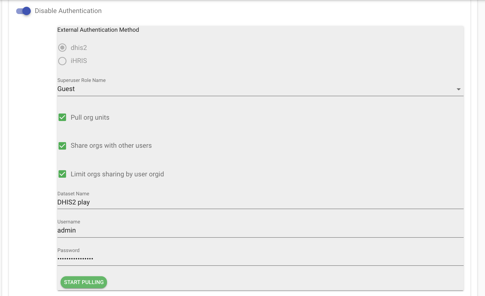

Select Pull to get data into the app. This is necessary for two-way communication to work between the app and the reconciliation backend.

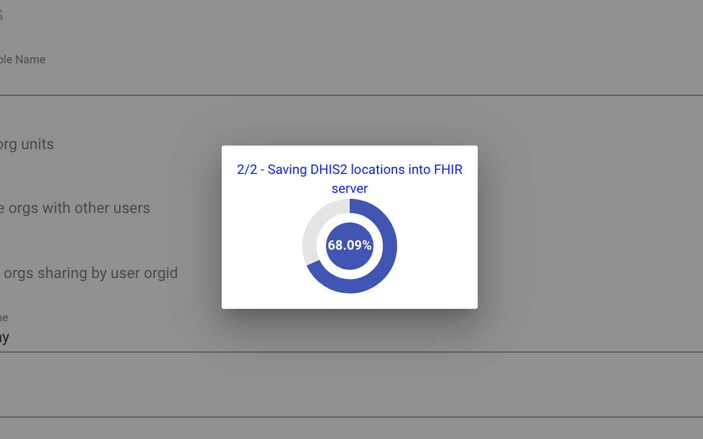

Once the app is done it will redirect to the data sources view to confirm the DHIS2 data source is now there.


## Install DHIS2 app on DHIS playground

The Facility Reconciliation Tool should be running. A quick way to do this for a demo is to use Docker.

Visit https://play.dhis2.org and select a DHIS2 demo version. 

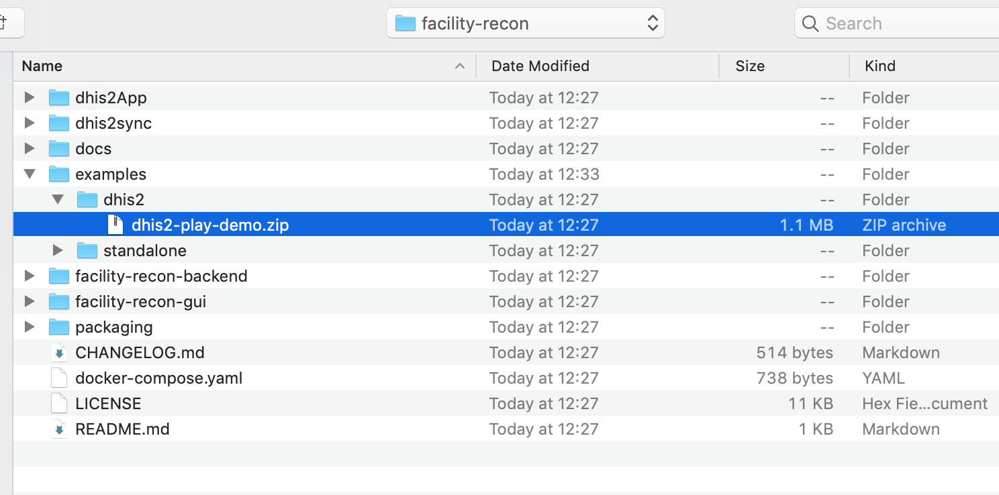

Follow the above recipe but use the prebuilt version designed for DHIS2 playground.

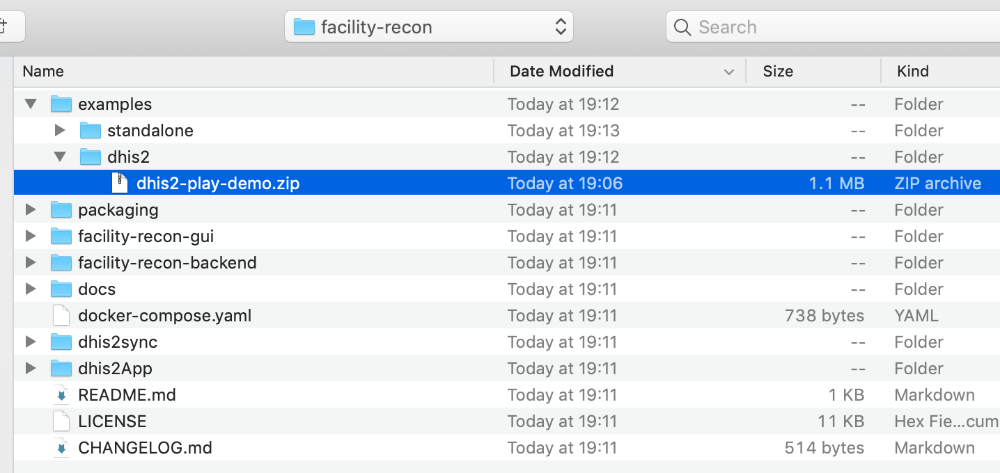

Then follow the rest of the recipe above.


## Setup a different backend server

If the DHIS2 app must talk to a backend that is on another server, then the prebuilt package is not suitable and must be rebuilt with the correct address.


The file `/facility-recon-gui/config/prod.env.js` must be modified.
```js
'use strict'
module.exports = {
  NODE_ENV: '"production"',
  BACKEND_SERVER: '"./"'
}
```

Change the `BACKEND_SERVER` variable to the server. For example, for localhost:
```js
'use strict'
module.exports = {
  NODE_ENV: '"production"',
  BACKEND_SERVER: '"http://localhost:3000"'
}
```

Once the file is edited and saved, build the gui.
```
cd facility-recon-gui
npm install
# there may be build warnings.
npm run build
```

The new app is installed in the root as `/dhis2App/GOFR.zip`. This is now built with the server chosen in the above step and can be installed into DHIS2.