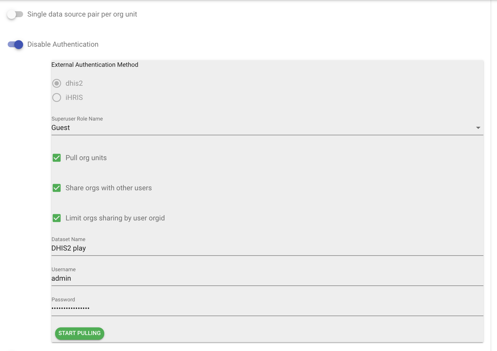
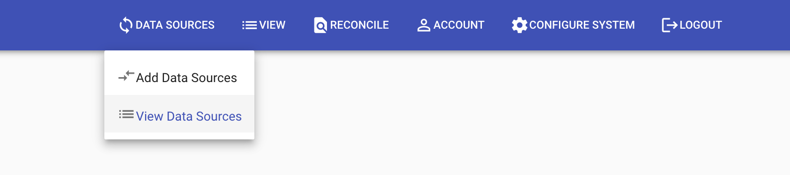
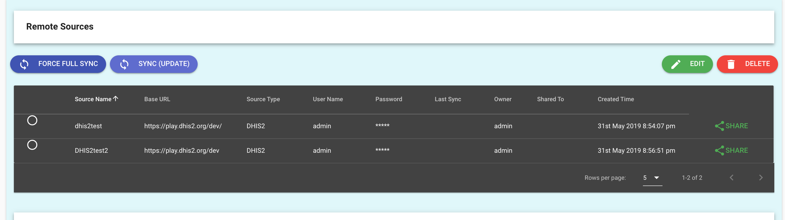
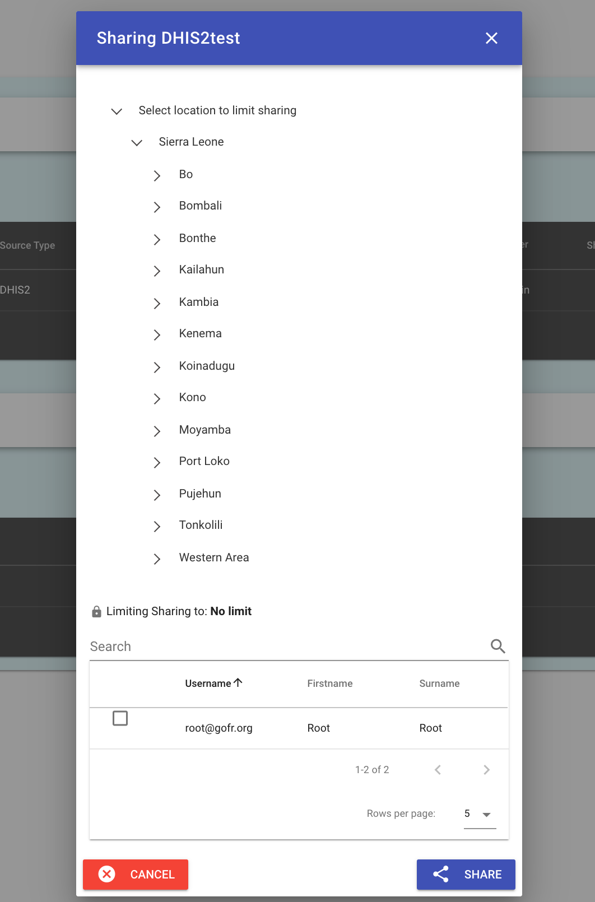
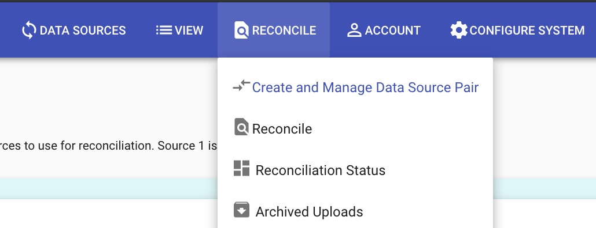
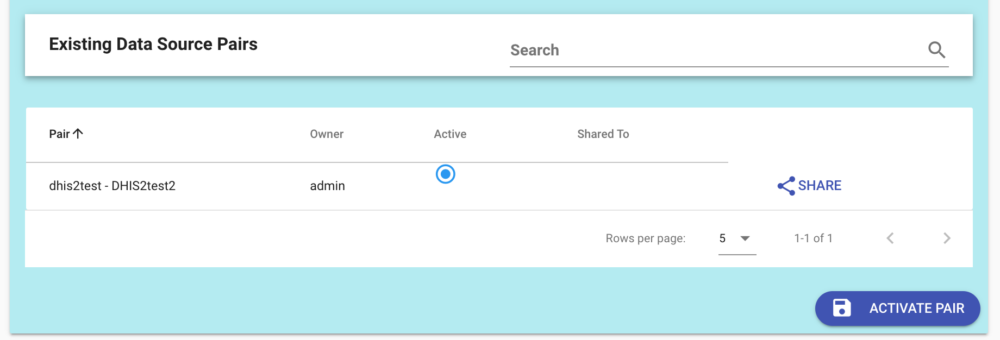
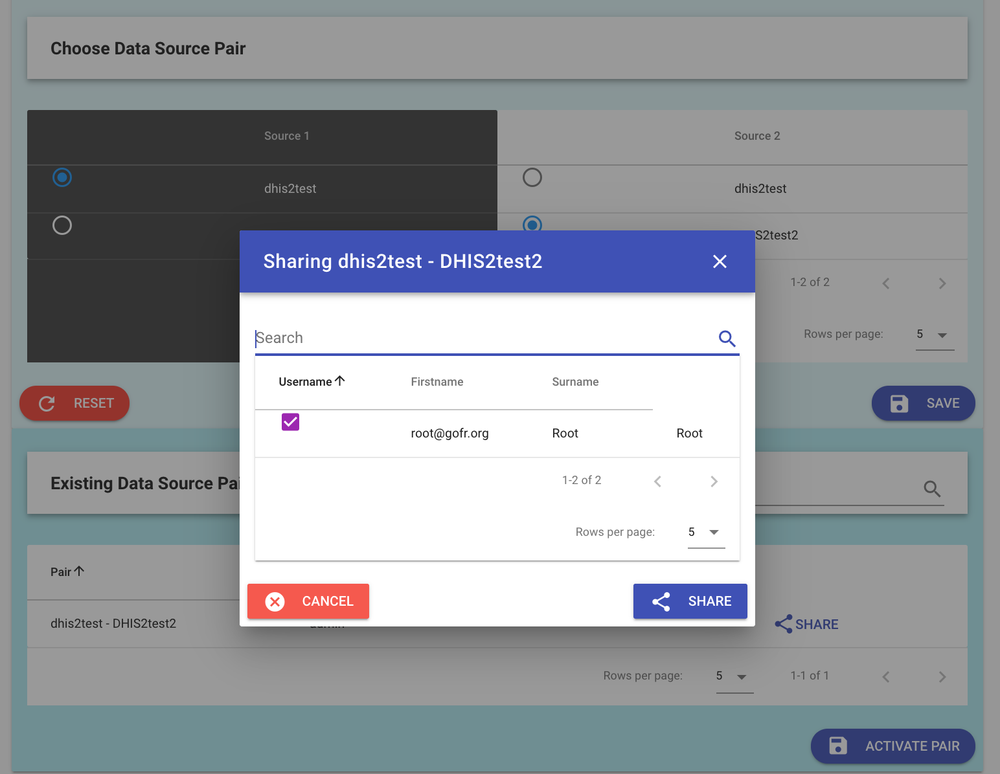

# DHIS2 users and sharing

With DHIS2 set as the authentication layer, users from DHIS2 can be given access to particular data sources and pairs, be restricted to pairs, and have their organizational unit restrictions also be reflected in the Facility Reconciliation Tool.

## Prequisites

* The Facility Reconciliation Tool application must be running.
* Then, the app should be installed. See the developer guide page for DHIS2 app installation.
* Once DHIS2 is the authentication layer, users must exist in DHIS2 for them to be able to use the Facility Reconciliation App.

## About DHIS2 users

The building blocks of user management in DHIS2 are authorities, users, user roles, and user groups. See the [latest DHIS2 documentation](https://docs.dhis2.org/master/en/user/html/manage_user_role_group.html#) for an overview which is partly reproduced here.

Types | Description |
--- | --- |
**Authorities** | Permissions to perform tasks like adding data sets, creating data elements, or viewing reports.  |
**Users** | An individual's account. |
**User roles** | Required for each user. Roles may be used to assign particular data sets and authorities on the system to perform tasks. |
**User groups** | Groups of users. User groups may be cross-cutting, so for example there may be a group of users who manage an HIV prevention program. They may have different user roles but they can also be in the same program group. |

## Configuration options

When the Facility Reconciliation DHIS2 App is installed and DHIS2 is selected as an authentication source, a DHIS2 superuser role must be selected. There are several additional options.

In the default settings:
* Users will be able to only see the org units they have permission to see in DHIS2.
* Org units can be pulled into the Facility Reconciliation Tool into a dataset named as desired.
* Org units can be shared to users and not just the user who configured the system.

The default configurations may be switched on or off as desired.

Options| Default (Y/N) | Description |
--- | --- | --- |
**Pull org units** | Yes | Once selected, the user who sets up DHIS2 integration may choose to pull org units into the Facility Reconciliation app. Generally, the expectation is that if DHIS2 is the authentication source, then the user would prefer to pull org units from it as a data source. But, this switch allows for that assumption to be optional. |
**Share orgs with other users** | Yes | This option allows for the DHIS2 organizational units data to be used by others rather than just the individual who configured the system. |
**Limit orgs sharing by orgid** | Yes | This option allows org unit restrictions in DHIS2 to be respected in the Facility Reconciliation Tool. This means that if a user is confined to one org in DHIS2 that they will also be limited in the same way in the DHIS2 app. |

## Share data sources

Any existing data source can be shared to a DHIS2 user that has permission to use the app. One may share a dataset to particular users or all users or to limit the dataset based on the organization unit attached to DHIS2.

Click on the Data Sources tab and choose to View Data Sources.

Sharing status is listed for each data source and if not being shared it is blank.

Click on the share button to bring up the menu.

Sharing can be limited by either or both the user or location (DHIS2 org unit).

## Share data pairs

Data sharing of pairs is similar to that of data sources.

Go to the Reconcile tab and select Create and Manage Data Source Pair.

This page lists the pairs and is where to create pairs. In this example, we have two data sources from the DHIS2 currently being used and one for a remote DHIS2.

The sharing status can be seen in the list data pairs.

Click the Share button on the right hand side of the data source in the list to expand the pair sharing menu.

