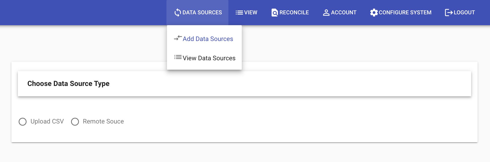
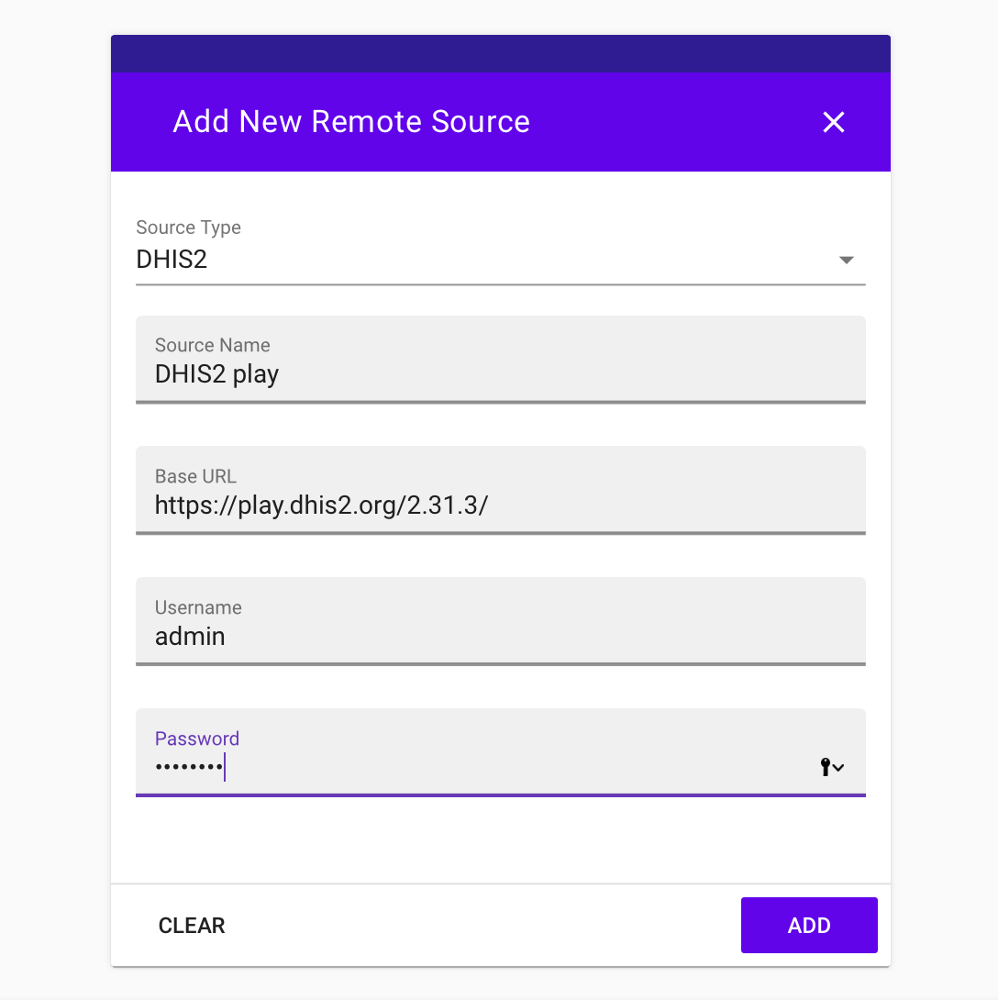
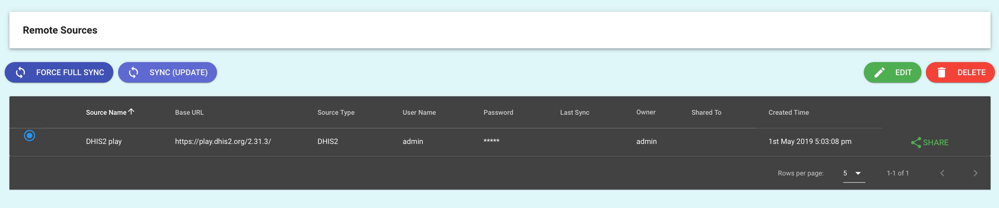

# Add DHIS2 source

This example uses the DHIS2 Playground which is already loaded with fake but realistic facility data. 

## Configure DHIS2 Data Source

To connect to any DHIS2, you need a username and password and the URL (website address) of the DHIS2. This example uses the demo playground provided username and password. 

Any DHIS2 server can be used as a source for which the user can authenticate and is authorized to get the facility and hierarchy. 

The Base URL is the website for the DHIS2. The example URL for the playground may be a bit confusing because it has '/2.31.3' but that is because the playground is hosting many DHIS2 versions at the same address like '/2.32' etc. In other DHIS2, there will be no '/version'.

* Open the Facility Reconciliation Tool. Select 'Data Sources'

* Select Remote Source

* In the Add New Remote Source form, put in the following:

| Field | Entry | Notes |
| ----------- | ----------- | ----------- |
| **Source Type** | **DHIS2** | This configures the form for DHIS2. |
| **Source Name** | **DHIS2 play** | Any name is acceptable. |
| **Base URL** | **https://play.dhis2.org/2.31.3/** | DHIS2 playground for version 2.31. Other DHIS2 do not have /version. |
| **Username** | **admin** | This is the username for the playground. |
| **Password** | **district** | This is the password for 'admin' user of the playground. |

* Click Add.

## Sync

Select View Data Sources from the Data Sources tab.

The data will not be pulled from DHIS2 unless you Force Sync or Sync Update.
* Click next to the DHIS source you added to select it.
* Click Sync Update.

The Facility Reconciliation Tool will now add the data from the DHIS2 source. To continue, add another another data source or if there is already one you wish to match, then create a data pair.

