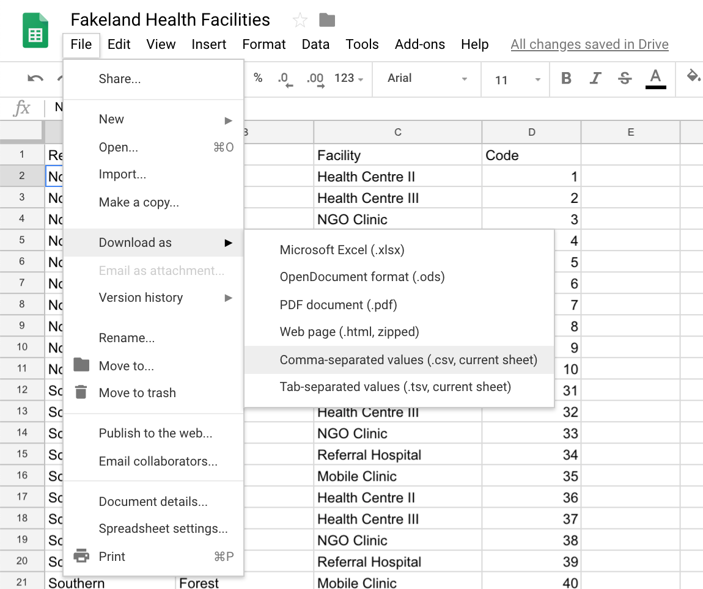
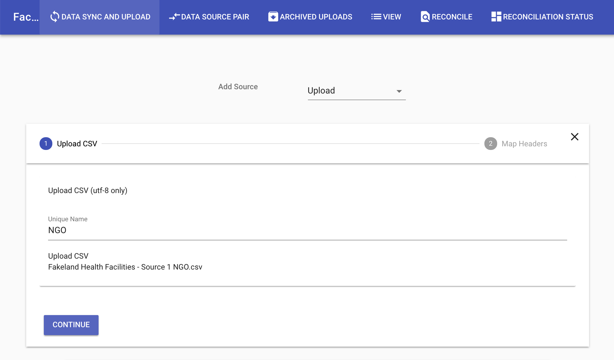
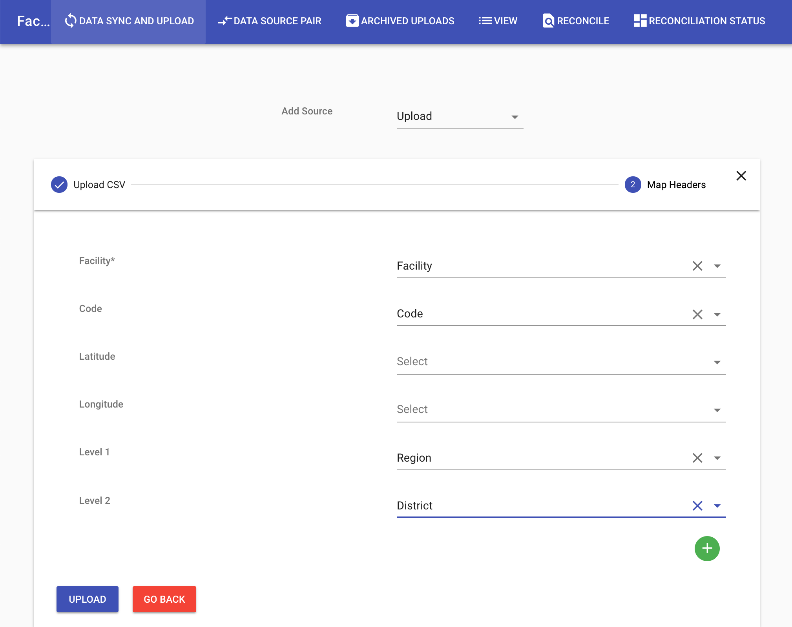
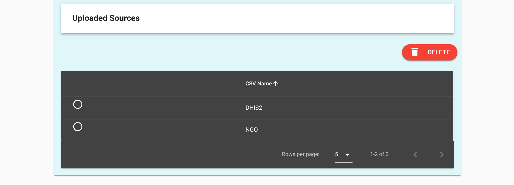

# Example data

## Download the example data

* Go to the example workbook for [Fakeland Health Facilities data](https://docs.google.com/spreadsheets/d/1ydVGWlNKHaxGoRp8xPy6pi8TO0H33cockD73zaeO8F8).
* There are two worksheets inside (see the tabs at the bottom), one for Source 1 NGO and one for Source 2 DHIS2. These are fake data for use in the tool.
* Download each tab as a separate CSV files to your computer by clicking under the File menu and choosing Download as: Comma-separated values
* Save the files to your computer in an easily accessible folder. 

## Upload Data

* Go to the reconciliation tool from the site: https://facilitymatch.org and click DEMO. You will be shown a disclaimer. If you agree, then click to continue.
* On the hosted version, login using demo:demo for user:password.
* On the site, choose Add Source in the top center of the page and select Upload CSV.

* Name the upload as desired and click Upload CSV. Select the Fakeland Health Facilities - Source 1 NGO file from where you saved it on your computer.
* Click Continue. The data will be loaded into the system. 

* You will be in a new dialog that asks you to assign headers for facility name, facility ID code, and administrative levels. Please select the correct headers from the dropdown menu as indicated in the screenshot below.

* Click the blue Upload button.
* Repeat the above steps for uploading data but this time call the upload DHIS2 and choose the file Fakeland Health Facilities - Source 2 DHIS2 file on your computer.
* You should now have two data sources.

