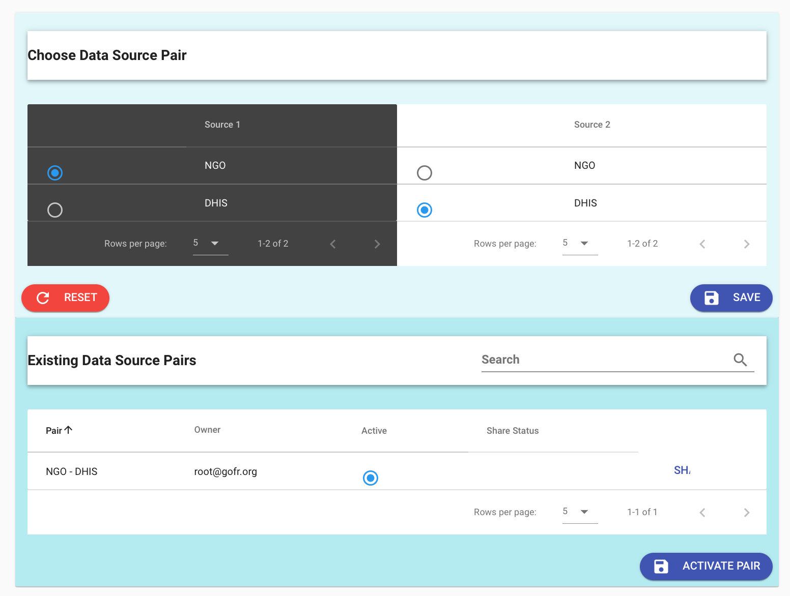
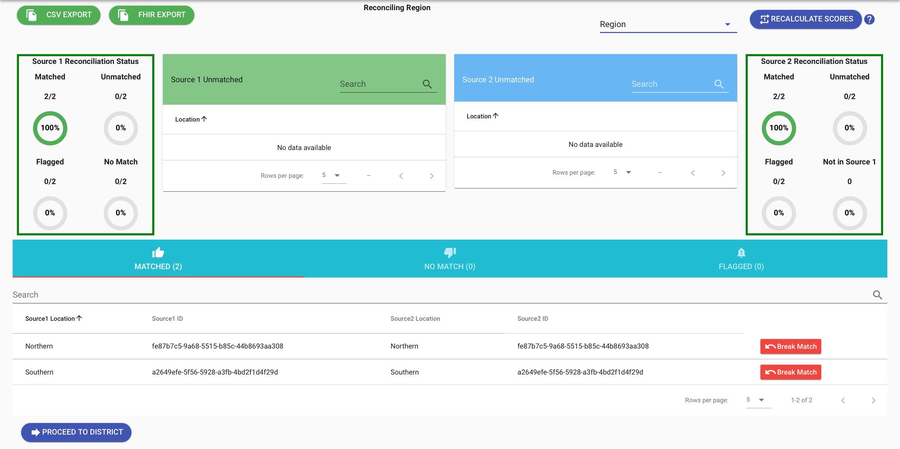
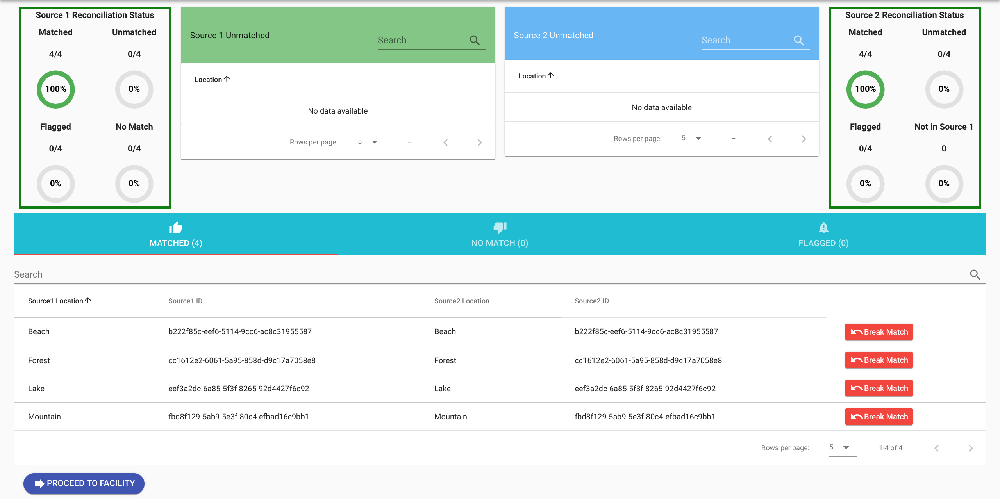
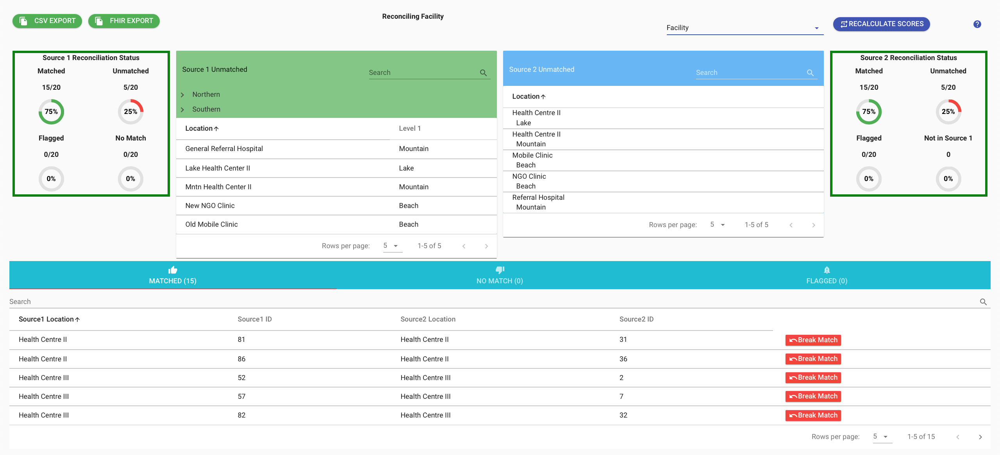
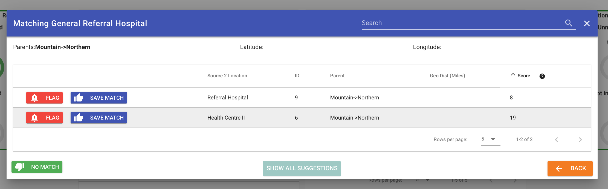
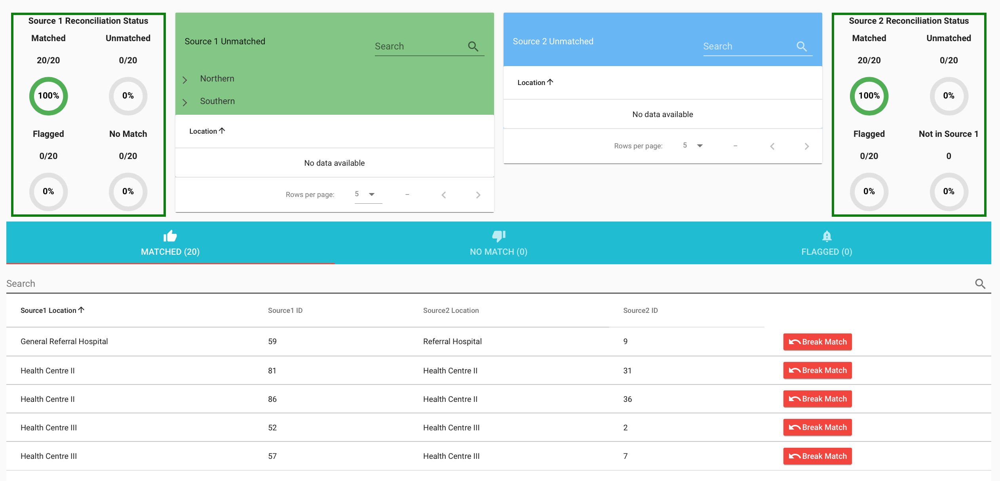
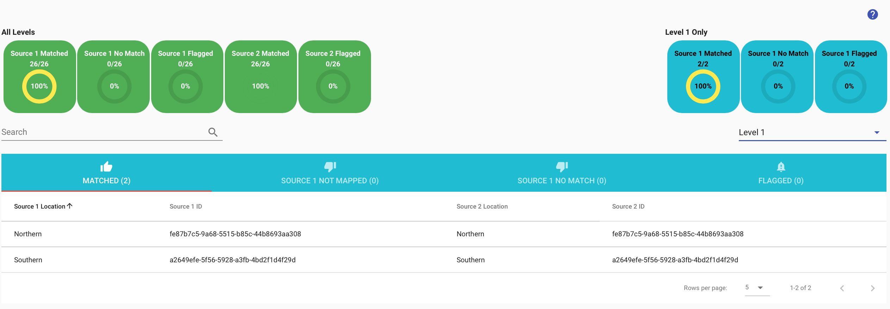

# Match data sources

To match facility lists the steps are to first create a pair of data sources and then to do the reconciliation starting at the highest level and going down the hierarchy to the last level.

## Pair data sources

* Go to the Reconcile tab and choose Create and Manage Data Source Pair. Select both data sources. The data source you select under Source 1 source of truth. The data source you select under Source 2 is the one that you want to fix.

* Choose DHIS2 as Source 1 and NGO as Source 2.

* Click Save and you will be taken to the Reconcile page.

> Note. After saving the pair should be active. If not, then below the pair choose Active under Existing Data Source Pairs. Then click Activate Pair.

## Reconciliation

* There are only two regions (the top administrative level in the fakeland data). They are automatically matched. The status wheels labeled Matched indicate that 2 of 2 regions have been matched. In the bottom portion of the screenshot below, you can also see that for Level 1 there is 100% match, as the two locations in Source 1 match the two locations in Source 2.

* Near the bottom left click Proceed to District to continue.

* At Level 2, the districts will automatically be matched. Click Proceed to Facility to continue.

* Click Proceed to Level 3.
* At Level 3, some facilities will not match.
* There is a list of unmatched facilities in the light green box for Source 1.

* Select one of the facilities, like General Referral Hospital.
* A pop-up dialog will let you choose which facility to match it to.

* Select the most appropriate match, in this case it is Referral Hospital, and click Save Match.
* Go through the unmatched facilities in Source 1, select and save the best matches. One you are done, you will see:

* The Source 1 Reconciliation Status, in the top left-hand status box, should be 100%.

## Export a reconciliation report

* On the top left of the reconciliation tab there is an option to output either a FHIR-based report of the final reconciled dataset or a CSV of what matched and did not match in either dataset. Choose CSV Export. You will be able to choose three files of matches and unmatches.

## View reconciliation status

* Select Reconciliation Status and view the overall status.

