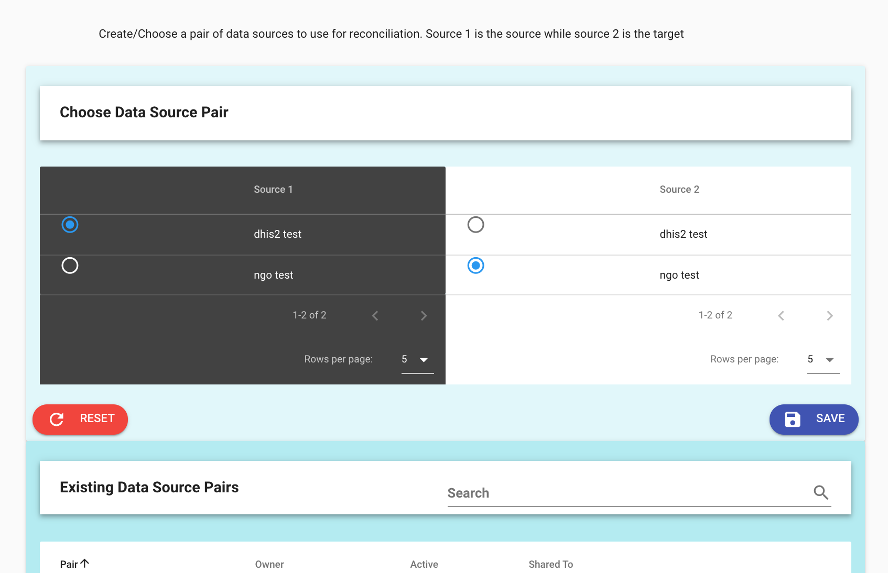
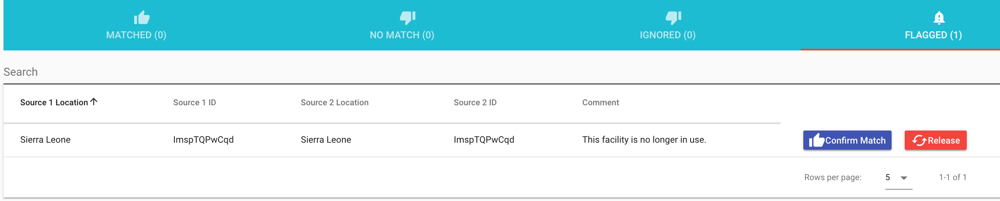

# Match

*Note that there is a video tutorial on how to match on the [OpenHIE YouTube channel](https://www.youtube.com/channel/UCYYpnvTCdGfgi_nIBzsd73Q) and a quick start in this documentation.*

Reconciling data sources involves choosing a pair of sources to work with and then running the automatic or manual matching tool. Any kind of match can be undone.

## Pair sources

Under the Reconcile tab is the Create and Manage Data Source page. On the pair tab select one source on the left and one on the right. The source on the left (source 1) is the leader -- the source of truth. The source on the right is the follower, the source that is meant to be cleaned.

In the pairing process it is possible to share the pair with another user who may join in helping to match, for example where they are familiar with a specific area.

## Automatic matching

When the reconciliation process starts it uses automatic matching. Matching proceeds like this:

- The first level matches the highest administrative area names (termed region in the tool) using the [Levenshtein distance](https://en.wikipedia.org/wiki/Levenshtein_distance). 
- The second level matches based on the first level and also the Levenshtein distance for the second level names, termed district in the tool.
- The final level matches based on the second level (which was already matched according to the level above it) as well as the Levenshtein distance.

## Recalculate scores

During the matching process at any level, it is possible to ask the tool to match unmatched entities using the Recalculate Scores button. This process does not remove matches.

One common use for this is afer manual matching of any entities, to rerun the matching process and incorporate the results. This can also be used when an entity is is freed for matching after having been previously flagged.

## Manual matching

Manual matching brings up a dialog box to choose options. If latitude and longitude coordinates were provided in the data sources, it additionally scores matches based on the [haversine formula](https://en.wikipedia.org/wiki/Haversine_formula) for shortest path across a sphere (geodesic distance) between the points. This is not used in the automatic matching but is provided for manual matching.

Any administrative area or facility match may be broken. If this is desired, click Recalculate Scores to rebuild the scoring index and manually match or flag as desired.

### Parent constraints

The default is to match facilities between sources based on hierarchies only. This means that if a facility is in the wrong nested administrative level, it will not be matched. 

Under the Configure System tab the parent constraint can be disabled to allow for matching of all facilities across the sources.

### Reconcile without levels

It is possible to match facilities from a flat list with no hierarchies. 

### Notifications

When admins share a set of facilities for matching to a data manager, the data manager is notified by email when the matching is completed. 

### Flagging

Flagging allows for an export of facilities that require further examination and research. When a flag is set, the user may also include a comment.

Flags may be set on any entity. For example, an organizational unit or a facility.

In order to see flagged items and their comments click the FLAGGED tab on the bottom of the RECONCILE menu for the level of interest. In this example, an org unit is flagged.

Also in this example, once flagged, a facility or administrative unit may be released back for matching to another entity, or the match that was flagged may be confirmed.
