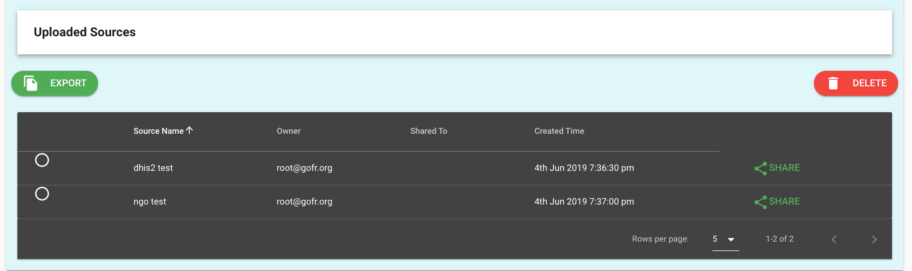
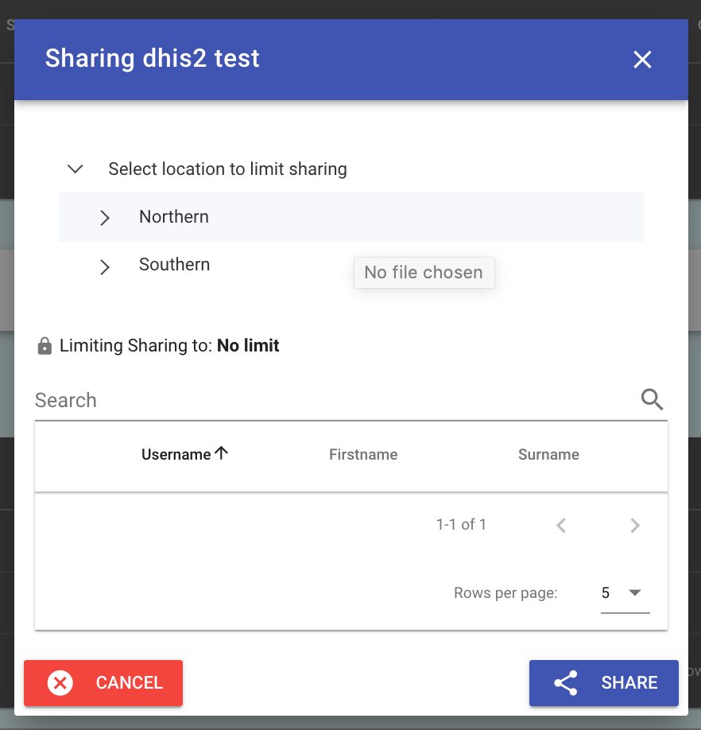
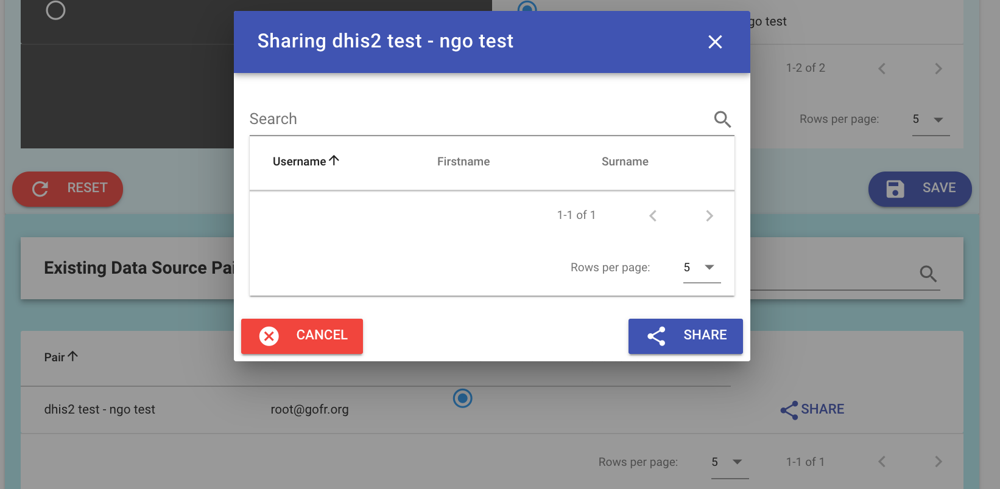
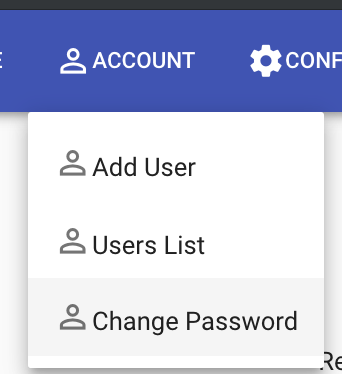

# Users and sharing

There are two classes of users, admin and data managers. The initial server configuration includes an administrator role. This account and password should be immediately changed after installation. See the Developer Guide for more information.

## Roles

* **Admin** accounts can add users, configure the system, and all tasks of data managers.

* **Data manager** accounts can manage data only. They can share data sources and do other matching tasks.

* **Custom** accounts with specific roles may be created in the future. Please let the community know if you have use cases for custom account roles.

## Self-registration

Administrators may configure the system to allow for anyone to self-register. This is under the Configure System tab. This option is off by default.

## Share a data source

Data sources may be shared by location to others or entirely.

On the Data Sources tab, select View Data Sources. 

Select the Share button on the far right.

This brings up a dialog to share data sources by user and location.

## Add to a Pair

Data managers and administrators are able to add other users to help with reconciliation. To do so, the data source pairing has an option to share the pairing with another user.

## Password reset

Under the Accounts tab a user password can be reset. The reset password is the user's surname exactly as it was entered including case.

